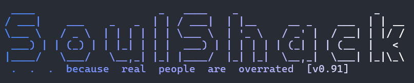

# Soulshack User Guide



**Soulshack** is an advanced IRC chatbot powered by LLMs, designed to bridge traditional chat with modern AI capabilities.

## Features

-   **Multi-Provider Support**: Works with OpenAI, Anthropic, Google Gemini, and Ollama.
-   **Unified Tool System**: Supports shell scripts, MCP servers, and native IRC tools.
-   **Secure**: Full SSL/TLS and SASL authentication support.
-   **Session Management**: Configurable history, context window, and session TTL.
-   **Streaming**: Real-time responses with IRC-appropriate chunking.
-   **Passive Mode**: Optional URL watching and analysis.
-   **Runtime Configuration**: Manage settings via IRC commands.

## Quickstart

### Option 1: Docker

```bash
docker build . -t soulshack:dev
docker run -e SOULSHACK_OPENAIKEY=sk-... soulshack:dev --channel '#soulshack'
```

### Option 2: Build from Source

**Prerequisites**: Go 1.23+

1.  **Clone and Build**:
    ```bash
    git clone https://github.com/pkdindustries/soulshack.git
    cd soulshack
    go build -o soulshack cmd/soulshack/main.go
    ```

2.  **Run**:
    ```bash
    # OpenAI
    ./soulshack --nick chatbot --server irc.libera.chat --tls \
      --channel '#soulshack' --model openai/gpt-4o --openaikey "sk-..."

    # Ollama (Local)
    ./soulshack --channel '#soulshack' --model ollama/llama3.2
    ```

## Configuration

Soulshack can be configured via command-line flags, environment variables (`SOULSHACK_*`), or a YAML config file.

### Configuration Flags

| Flag | Default | Description |
|------|---------|-------------|
| `-n, --nick` | soulshack | Bot nickname |
| `-s, --server` | localhost | IRC server address |
| `-p, --port` | 6667 | IRC server port |
| `-c, --channel` | | Channel to join |
| `-e, --tls` | false | Enable TLS |
| `--tlsinsecure` | false | Skip TLS cert verification |
| `--saslnick` | | SASL username |
| `--saslpass` | | SASL password |
| `-b, --config` | | Path to YAML config file |
| `-A, --admins` | | Comma-separated admin hostmasks |
| `-V, --verbose` | false | Enable debug logging |
| `--model` | ollama/llama3.2 | LLM model (`provider/name`) |
| `--maxtokens` | 4096 | Max tokens per response |
| `--temperature` | 0.7 | Sampling temperature |
| `-t, --apitimeout` | 5m | API request timeout |
| `--openaikey` | | OpenAI API key |
| `--anthropickey` | | Anthropic API key |
| `--geminikey` | | Google Gemini API key |
| `--ollamaurl` | http://localhost:11434 | Ollama API endpoint |
| `--tool` | | Path to tool definition (repeatable) |
| `--thinking` | false | Enable reasoning mode |
| `--urlwatcher` | false | Enable passive URL watching |

### YAML Configuration

Create a `config.yaml` file:

```yaml
server:
  nick: "soulshack"
  server: "irc.libera.chat"
  port: 6697
  channel: "#soulshack"
  tls: true

bot:
  admins: ["nick!user@host"]
  tools:
    - "examples/tools/datetime.sh"
    - "examples/mcp/filesystem.json"
```

Run with: `./soulshack --config config.yaml`

## Commands

| Command | Admin? | Description |
|---------|--------|-------------|
| `/help` | No | Show available commands |
| `/version` | No | Show bot version |
| `/tools` | No | List loaded tools |
| `/tools add <spec>` | Yes | Add a tool at runtime |
| `/tools remove <pattern>` | Yes | Remove a tool |
| `/admins` | Yes | List admins |
| `/admins add <hostmask>` | Yes | Add an admin |
| `/set <key> <value>` | Yes | Set config parameter |
| `/get <key>` | No | Get config parameter |

## Built-in Tools

Soulshack comes with native IRC management tools (permissions apply):

-   `irc_op`, `irc_deop`: Grant/revoke operator status.
-   `irc_kick`, `irc_ban`, `irc_unban`: User management.
-   `irc_topic`: Set channel topic.
-   `irc_invite`: Invite users to channel.
-   `irc_mode_set`, `irc_mode_query`: Manage channel modes.
-   `irc_names`, `irc_whois`: User information.

## Documentation

-   [Modifying Code](docs/modifying_code.md): Guide for adding commands and tools.
-   [Architecture](docs/architecture.md): High-level system overview.

---
*Named as tribute to my old friend dayv, sp0t, who i think of often.*
