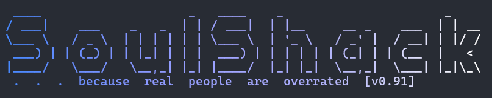

# Soulshack User Guide



**Soulshack** is an advanced IRC chatbot powered by LLMs, designed to bridge traditional chat with modern AI capabilities.

## Features

-   **Multi-Provider Support**: Works with OpenAI, Anthropic, Google Gemini, and Ollama.
-   **Unified Tool System**: Supports shell scripts, MCP servers, and native IRC tools.
-   **Secure**: Full SSL/TLS and SASL authentication support.
-   **Session Management**: Configurable history, context window, and session TTL.
-   **Streaming**: Real-time responses with IRC-appropriate chunking.
-   **Passive Mode**: Optional URL watching and analysis.
-   **Runtime Configuration**: Manage settings via IRC commands.

## Quickstart

### Option 1: Docker

```bash
docker build . -t soulshack:dev
```

### Option 2: Build from Source

**Prerequisites**: Go 1.23+

1.  **Clone and Build**:
    ```bash
    git clone https://github.com/pkdindustries/soulshack.git
    cd soulshack
    go build -o soulshack cmd/soulshack/main.go
    ```

2.  **Run**:

    ### Configuration File (Recommended)
    
    **Local Binary**:
    ```bash
    ./soulshack --config examples/chatbot.yml
    ```

    **Docker**:
    ```bash
    # Mount config file to container
    docker run -v $(pwd)/examples/chatbot.yml:/config.yml soulshack:dev \
      --config /config.yml
    ```

    ### All Flags (Kitchen Sink)

    **Local Binary**:
    ```bash
    ./soulshack \
      --nick soulshack \
      --server irc.example.com \
      --port 6697 \
      --tls \
      --channel '#soulshack' \
      --saslnick mybot \
      --saslpass mypassword \
      --admins "admin!*@*" \
      --model openai/gpt-5.1 \
      --openaikey "sk-..." \
      --maxtokens 4096 \
      --temperature 1 \
      --apitimeout 5m \
      --tool "examples/tools/datetime.sh" \
      --tool "irc__op" \
      --thinkingeffort off \
      --urlwatcher \
      --verbose
    ```

    **Docker**:
    ```bash
    docker run soulshack:dev \
      --nick soulshack \
      --server irc.example.com \
      --port 6697 \
      --tls \
      --channel '#soulshack' \
      --saslnick mybot \
      --saslpass mypassword \
      --admins "admin!*@*" \
      --model openai/gpt-5.1 \
      --openaikey "sk-..." \
      --maxtokens 4096 \
      --temperature 1 \
      --apitimeout 5m \
      --thinkingeffort off \
      --urlwatcher \
      --verbose
    # Note: Local file tools/scripts require volume mounts to work in Docker
    ```

    ### Ollama (Local)

    **Local Binary**:
    ```bash
    ./soulshack \
      --server irc.example.com \
      --channel '#soulshack' \
      --model ollama/qwen3:30b \
      --ollamaurl "http://localhost:11434"
    ```

    **Docker**:
    ```bash
    # Use --network host to access Ollama on localhost
    docker run --network host soulshack:dev \
      --server irc.example.com \
      --channel '#soulshack' \
      --model ollama/qwen3:30b \
      --ollamaurl "http://localhost:11434"
    ```

    ### Anthropic

    **Local Binary**:
    ```bash
    ./soulshack \
      --server irc.example.com \
      --channel '#soulshack' \
      --model anthropic/claude-opus-4.5 \
      --anthropickey "sk-ant-..."
    ```

    **Docker**:
    ```bash
    docker run soulshack:dev \
      --server irc.example.com \
      --channel '#soulshack' \
      --model anthropic/claude-opus-4.5 \
      --anthropickey "sk-ant-..."
    ```


### Configuration Flags

| Flag | Default | Description |
|------|---------|-------------|
| `-n, --nick` | soulshack | Bot nickname |
| `-s, --server` | localhost | IRC server address |
| `-p, --port` | 6667 | IRC server port |
| `-c, --channel` | | Channel to join |
| `-e, --tls` | false | Enable TLS |
| `--tlsinsecure` | false | Skip TLS cert verification |
| `--saslnick` | | SASL username |
| `--saslpass` | | SASL password |
| `-b, --config` | | Path to YAML config file |
| `-A, --admins` | | Comma-separated admin hostmasks |
| `-V, --verbose` | false | Enable debug logging |
| `--model` | ollama/llama3.2 | LLM model (`provider/name`) |
| `--maxtokens` | 4096 | Max tokens per response |
| `--temperature` | 0.7 | Sampling temperature |
| `-t, --apitimeout` | 5m | API request timeout |
| `--openaikey` | | OpenAI API key |
| `--anthropickey` | | Anthropic API key |
| `--geminikey` | | Google Gemini API key |
| `--ollamaurl` | http://localhost:11434 | Ollama API endpoint |
| `--tool` | | Path to tool definition (repeatable) |
| `--thinkingeffort` | off | Reasoning effort level: off, low, medium, high |
| `--urlwatcher` | false | Enable passive URL watching |
| `--sandbox` | false | Sandbox shell, bash, and MCP tools (see below) |

### YAML Configuration

Create a `config.yml` file:

```yaml
server:
  nick: "soulshack"
  server: "irc.example.com"
  port: 6697
  channel: "#soulshack"
  tls: true

bot:
  admins: ["nick!user@host"]
  tools:
    - "examples/tools/datetime.sh"
    - "examples/mcp/filesystem.json"
```

Run with: `./soulshack --config config.yml`

## Commands

| Command | Admin? | Description |
|---------|--------|-------------|
| `/help` | No | Show available commands |
| `/version` | No | Show bot version |
| `/tools` | No | List loaded tools |
| `/tools add <spec>` | Yes | Add a tool at runtime |
| `/tools remove <pattern>` | Yes | Remove a tool |
| `/admins` | Yes | List admins |
| `/admins add <hostmask>` | Yes | Add an admin |
| `/set <key> <value>` | Yes | Set config parameter |
| `/get <key>` | No | Get config parameter |

## Built-in Tools

Soulshack comes with native IRC management tools (permissions apply):

-   `irc_op`, `irc_deop`: Grant/revoke operator status.
-   `irc_kick`, `irc_ban`, `irc_unban`: User management.
-   `irc_topic`: Set channel topic.
-   `irc_invite`: Invite users to channel.
-   `irc_mode_set`, `irc_mode_query`: Manage channel modes.
-   `irc_names`, `irc_whois`: User information.

## Sandboxing

With `--sandbox` (or `sandbox: true` in YAML, env `SOULSHACK_SANDBOX`), all shell scripts, the built-in `bash` tool, and MCP servers launched via `--tool` run inside a platform sandbox. Disabled by default.

**Requirements**: `sandbox-exec` on macOS, `bwrap` (bubblewrap) on Linux. If the backend isn't available the flag is ignored with a `sandbox_unavailable` warning and tools run as before.

**Default policy** (applied to every sandboxed tool):

-   Writes allowed only under the OS temp directory.
-   Outbound network blocked.
-   Sensitive paths blocked from reads: `~/.ssh`, `~/.gnupg`, `~/.aws`, `~/.azure`, `~/.config/gcloud`, `~/.kube`, `~/.docker/config.json`, `~/.npmrc`, `~/.config/gh`, `~/.netrc`, `~/.git-credentials`, macOS keychains, and other credential stores.
-   Each sandboxed tool's description gets a `[sandboxed]` suffix so the model knows it's restricted.

**Per-tool overrides** — shell scripts declare a `sandbox` field in their `--schema` output; MCP server JSON files add it alongside `command`/`args`:

```json
"sandbox": true
"sandbox": { "allowNetwork": true, "writablePaths": ["/tmp/data"] }
"sandbox": { "denyWrite": true }
"sandbox": { "allowEnv": ["HOME", "PATH"] }
```

`false` opts the tool out entirely (runs unsandboxed even when `--sandbox` is enabled). Absence of the field uses the default policy above. `POLLYTOOL_*` env vars are always stripped from sandboxed processes unless listed in `allowEnv`.

Native IRC tools (`irc_op`, `irc_kick`, etc.) run in-process and are unaffected.

The sandbox itself lives in pollytool — for the full config schema, merge semantics, and per-platform backend details see [pollytool's Sandboxing section](https://github.com/alexschlessinger/pollytool#sandboxing) and [API.md](https://github.com/alexschlessinger/pollytool/blob/main/API.md).

## Documentation

-   [Contributing](docs/contributing.md): Guide for adding commands and tools.
-   [Architecture](docs/architecture.md): High-level system overview.

---
*Named as tribute to my old friend dayv, sp0t, who i think of often.*
