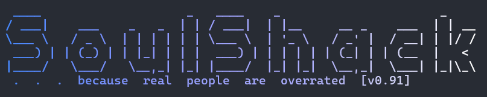

# Soulshack User Guide



**Soulshack** is an advanced IRC chatbot powered by LLMs, designed to bridge traditional chat with modern AI capabilities.

## Features

-   **Multi-Provider Support**: Works with OpenAI, Anthropic, Google Gemini, and Ollama.
-   **Unified Tool System**: Supports shell scripts, MCP servers, and native IRC tools.
-   **Secure**: Full SSL/TLS and SASL authentication support.
-   **Conversation Management**: Per-channel memory with a configurable context window and idle expiry.
-   **Streaming**: Real-time responses with IRC-appropriate chunking.
-   **Passive Mode**: Optional URL watching and analysis.
-   **Runtime Configuration**: Manage settings via IRC commands.

## Quickstart

### Option 1: Docker

```bash
docker build . -t soulshack:dev
```

### Option 2: Build from Source

**Prerequisites**: Go 1.23+

1.  **Clone and Build**:
    ```bash
    git clone https://github.com/pkdindustries/soulshack.git
    cd soulshack
    go build -o soulshack cmd/soulshack/main.go
    ```

2.  **Run**:

    ### Configuration File (Recommended)
    
    **Local Binary**:
    ```bash
    ./soulshack --config examples/chatbot.yml
    ```

    **Docker**:
    ```bash
    # Mount config file to container
    docker run -v $(pwd)/examples/chatbot.yml:/config.yml soulshack:dev \
      --config /config.yml
    ```

    ### All Flags (Kitchen Sink)

    **Local Binary**:
    ```bash
    ./soulshack \
      --nick soulshack \
      --server irc.example.com \
      --port 6697 \
      --tls \
      --channel '#soulshack' \
      --saslnick mybot \
      --saslpass mypassword \
      --admins "admin!*@*" \
      --model openai/gpt-5.1 \
      --openaikey "sk-..." \
      --maxtokens 4096 \
      --temperature 1 \
      --apitimeout 5m \
      --tool "examples/tools/datetime.sh" \
      --tool "irc__op" \
      --thinkingeffort off \
      --urlwatcher \
      --verbose
    ```

    **Docker**:
    ```bash
    docker run soulshack:dev \
      --nick soulshack \
      --server irc.example.com \
      --port 6697 \
      --tls \
      --channel '#soulshack' \
      --saslnick mybot \
      --saslpass mypassword \
      --admins "admin!*@*" \
      --model openai/gpt-5.1 \
      --openaikey "sk-..." \
      --maxtokens 4096 \
      --temperature 1 \
      --apitimeout 5m \
      --thinkingeffort off \
      --urlwatcher \
      --verbose
    # Note: Local file tools/scripts require volume mounts to work in Docker
    ```

    ### Ollama (Local)

    **Local Binary**:
    ```bash
    ./soulshack \
      --server irc.example.com \
      --channel '#soulshack' \
      --model ollama/qwen3:30b \
      --ollamaurl "http://localhost:11434"
    ```

    **Docker**:
    ```bash
    # Use --network host to access Ollama on localhost
    docker run --network host soulshack:dev \
      --server irc.example.com \
      --channel '#soulshack' \
      --model ollama/qwen3:30b \
      --ollamaurl "http://localhost:11434"
    ```

    ### Anthropic

    **Local Binary**:
    ```bash
    ./soulshack \
      --server irc.example.com \
      --channel '#soulshack' \
      --model anthropic/claude-opus-4.5 \
      --anthropickey "sk-ant-..."
    ```

    **Docker**:
    ```bash
    docker run soulshack:dev \
      --server irc.example.com \
      --channel '#soulshack' \
      --model anthropic/claude-opus-4.5 \
      --anthropickey "sk-ant-..."
    ```


### Configuration Flags

| Flag | Default | Description |
|------|---------|-------------|
| `-n, --nick` | soulshack | Bot nickname |
| `-s, --server` | localhost | IRC server address |
| `-p, --port` | 6667 | IRC server port |
| `-c, --channel` | | Channel to join |
| `-e, --tls` | false | Enable TLS |
| `--tlsinsecure` | false | Skip TLS cert verification |
| `--saslnick` | | SASL username |
| `--saslpass` | | SASL password |
| `-b, --config` | | Path to YAML config file |
| `-A, --admins` | | Comma-separated admin hostmasks |
| `-V, --verbose` | false | Enable debug logging |
| `--model` | ollama/llama3.2 | LLM model (`provider/name`) |
| `--maxtokens` | 4096 | Max tokens per response |
| `--maxcontext` | 0 | Token budget for a conversation: it bounds both what the model is sent and what is kept in memory (0 = unlimited) |
| `-S, --sessionduration` | 10m | A conversation is forgotten after this much inactivity (0 = no expiry) |
| `--temperature` | 0.7 | Sampling temperature |
| `-t, --apitimeout` | 5m | API request timeout |
| `--openaikey` | | OpenAI API key |
| `--anthropickey` | | Anthropic API key |
| `--geminikey` | | Google Gemini API key |
| `--deepseekkey` | | DeepSeek API key |
| `--openrouterkey` | | OpenRouter API key |
| `--huggingfacekey` | | Hugging Face API key |
| `--ollamaurl` | http://localhost:11434 | Ollama API endpoint |
| `--tool` | | Path to tool definition (repeatable) |
| `--thinkingeffort` | off | Reasoning effort level: off, low, medium, high |
| `--urlwatcher` | false | Enable passive URL watching |
| `--opwatcher` | false | Respond when the bot is opped or deopped |
| `--sandbox` | false | Sandbox shell, bash, and MCP tools (see below) |
| `--subagents` | false | Let the model delegate to background child agents (see below) |
| `--subagentmodel` | | Model for child agents (empty: the bot's own) |
| `--subagenttimeout` | 15m | How long a child agent may run |
| `--subagentmax` | 4 | Child agents running at once |
| `--subagentmaxperchat` | 2 | Child agents running at once for one conversation |

`--urlwatcher` reads links people post without being asked. That reading runs in the background, so the bot keeps answering the channel while it works, and the turn cannot delegate to a child agent: nobody requested the work, so it does not grow into more of it. With `--urlwatchersilent` the observation is discarded entirely.

`--opwatcher` passes the original MODE event to the model with sender attribution, for example `(nick:alice) MODE #channel +o soulshack`. It uses the channel's conversation history and sends replies normally, without a watcher-specific prompt template.

`/stats` shows the last completed model input separately from stored message counts and total provider token usage.

Conversations live in memory, one per channel (`#chan`) or per correspondent in private messages, and are forgotten after `--sessionduration` of inactivity. With `--maxcontext` set, a conversation keeps only the newest exchanges that fit, so a long-lived channel cannot grow without bound; `maxcontext` also caps what a request may send. Anything that changes what the model sees (`/set` of any key) starts the conversation over as a side effect.

### YAML Configuration

Create a `config.yml` file:

```yaml
server:
  nick: "soulshack"
  server: "irc.example.com"
  port: 6697
  channel: "#soulshack"
  tls: true

bot:
  admins: ["nick!user@host"]
  tools:
    - "examples/tools/datetime.sh"
    - "examples/tools/news.py"
```

Run with: `./soulshack --config config.yml`

## Commands

| Command | Admin? | Description |
|---------|--------|-------------|
| `/help` | No | Show available commands |
| `/version` | No | Show bot version |
| `/tools` | No | List loaded tools |
| `/tools add <spec>` | Yes | Add a tool at runtime |
| `/tools remove <pattern>` | Yes | Remove a tool |
| `/admins` | Yes | List admins |
| `/admins add <hostmask>` | Yes | Add an admin |
| `/set <key> <value>` | Yes | Set config parameter |
| `/get <key>` | No | Get config parameter |
| `/agents` | No | List child agents still working for this conversation |

Admin entries use full `nick!user@host` masks and match case-insensitively. `*` matches any number of characters and `?` matches one; other characters, including brackets, are literal. For example, use `admins: ["alex!*@trusted.example"]` in YAML or `/admins add alex!*@trusted.example` at runtime. Runtime additions last until restart.

## Subagents

With `--subagents`, the model is offered a `spawn_agent` tool for handing a self-contained task to a child agent: research, reading something large, anything with enough tool calls to leave the channel waiting.

Children always run in the background. The turn that spawns one ends as soon as the child has started, so the channel stays responsive, and the child keeps working after that turn is over. When it finishes, its report comes back as a turn of its own on that conversation, and the bot answers it in the channel in its own voice. A child that outlives the conversation it was asked in (see `--sessionduration`) has its report posted as it stands instead, since there is no longer anything to answer it against.

A child starts with only the brief it was given: the channel's conversation is not visible to it. It gets the bot's configured tools and the read-only IRC tools (`irc__names`, `irc__whois`, `irc__mode_query`), but never the ones that act on the channel, and never the ability to spawn agents of its own. Neither can the turn that delivers a report, so a child's answer cannot set off another child.

Ask the bot what it is working on and it can answer: it gets a `list_agents` tool for the agents still running in that conversation and how long each has been going, since its own transcript only records that a child started, not whether it has finished. `/agents` gives the same answer directly. Both are scoped to the conversation you ask in — agents working for another channel or correspondent are counted, never named.

Anyone in the channel can cause a spawn, the same as any other tool. `--subagentmax` and `--subagentmaxperchat` bound how many can be in flight at once; past the limit the model is told to wait rather than the call blocking.

Run children on a cheaper model than the bot answers with using `--subagentmodel`, for example `--subagentmodel ollama/llama3.2`.

## Built-in Tools

Soulshack comes with native IRC management tools (permissions apply):

-   `irc__op`: Configured bot admins may op/deop anyone; everyone else may op/deop themselves. With no admins configured, this tool allows only self-service. The bot must already be opped.
-   `irc__kick`, `irc__ban` (which also unbans): User management.
-   `irc__topic`: Set channel topic.
-   `irc__action`: Send a channel action.
-   `irc__invite`: Invite users to channel.
-   `irc__mode_set`, `irc__mode_query`: Manage channel modes.
-   `irc__names`, `irc__whois`: User information.

## Sandboxing

With `--sandbox` (or `sandbox: true` in YAML, env `SOULSHACK_SANDBOX`), all shell scripts, the built-in `bash` tool, and MCP servers launched via `--tool` run inside a platform sandbox. Disabled by default.

**Requirements**: `sandbox-exec` on macOS, `bwrap` (bubblewrap) on Linux. If the backend isn't available the flag is ignored with a `sandbox_unavailable` warning and tools run as before.

**Default policy** (applied to every sandboxed tool):

-   Writes allowed only under the OS temp directory.
-   Outbound network blocked.
-   Sensitive paths blocked from reads: `~/.ssh`, `~/.gnupg`, `~/.aws`, `~/.azure`, `~/.config/gcloud`, `~/.kube`, `~/.docker/config.json`, `~/.npmrc`, `~/.config/gh`, `~/.netrc`, `~/.git-credentials`, macOS keychains, and other credential stores.
-   Each sandboxed tool's description gets a `[sandboxed]` suffix so the model knows it's restricted.

**Per-tool overrides** — shell scripts declare a `sandbox` field in their `--schema` output; MCP server JSON files add it alongside `command`/`args`:

```json
"sandbox": true
"sandbox": { "allowNetwork": true, "writablePaths": ["/tmp/data"] }
"sandbox": { "denyWrite": true }
"sandbox": { "allowEnv": ["HOME", "PATH"] }
```

`false` opts the tool out entirely (runs unsandboxed even when `--sandbox` is enabled). Absence of the field uses the default policy above. `POLLYTOOL_*` env vars are always stripped from sandboxed processes unless listed in `allowEnv`.

Native IRC tools (`irc_op`, `irc_kick`, etc.) run in-process and are unaffected.

The sandbox itself lives in pollytool — for the full config schema, merge semantics, and per-platform backend details see [pollytool's Sandboxing section](https://github.com/alexschlessinger/pollytool#sandboxing) and [API.md](https://github.com/alexschlessinger/pollytool/blob/main/API.md).

## Documentation

-   [Contributing](docs/contributing.md): Guide for adding commands and tools.
-   [Architecture](docs/architecture.md): High-level system overview.

---
*Named as tribute to my old friend dayv, sp0t, who i think of often.*
