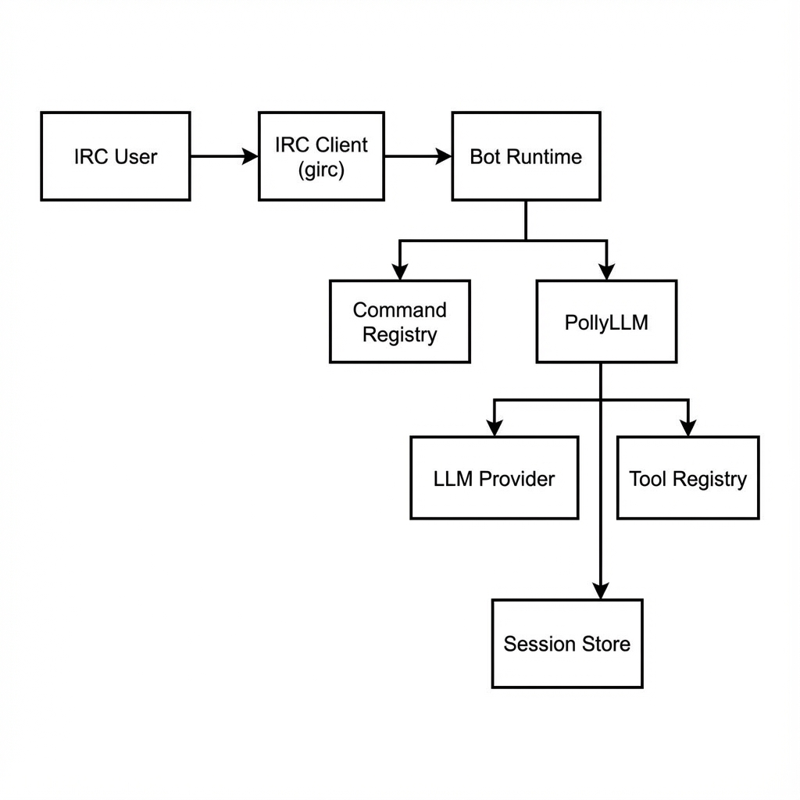

# Soulshack Architecture

## System Overview

Soulshack is an IRC bot designed to bridge traditional IRC chat with modern LLM capabilities. It uses a modular architecture to handle IRC events, manage sessions, and invoke LLM agents.

A key feature is its **Unified Tool System**, which abstracts differences between native Go tools, shell scripts, and MCP servers, allowing the LLM to use them interchangeably.

## Component Diagram

## Request Lifecycle

1.  **Event Reception**: `girc` receives a `PRIVMSG` or `JOIN` event.
2.  **Context Creation**: A `ChatContext` is created, wrapping the event, configuration, and session.
3.  **Locking**: A `RequestLock` ensures only one request is processed per channel at a time.
4.  **Dispatch**:
    -   If the message is a command (e.g., `/help`), it's dispatched to the `CommandRegistry`.
    -   If it's a chat message (and the bot is addressed), it's sent to the `PollyLLM`.
5.  **Execution**:
    -   **Commands** execute immediately and reply via `ChatContext`.
    -   **LLM** streams the request to the provider, potentially executing tools, and streams the response back to IRC.

## Key Interfaces

### `ChatContextInterface`
The primary interface passed to commands and LLM. It provides access to:
-   IRC operations (Reply, Join, Kick)
-   Configuration
-   Session data
-   User/Channel info

### `System`
Holds the singleton components:
-   `ToolRegistry`: Manages available tools.
-   `SessionStore`: Manages user/channel sessions.
-   `LLM`: The configured LLM client.

### `LLM`
Abstracts the AI provider.
-   `ChatCompletionStream`: Takes a context and request, returns a stream of strings.
