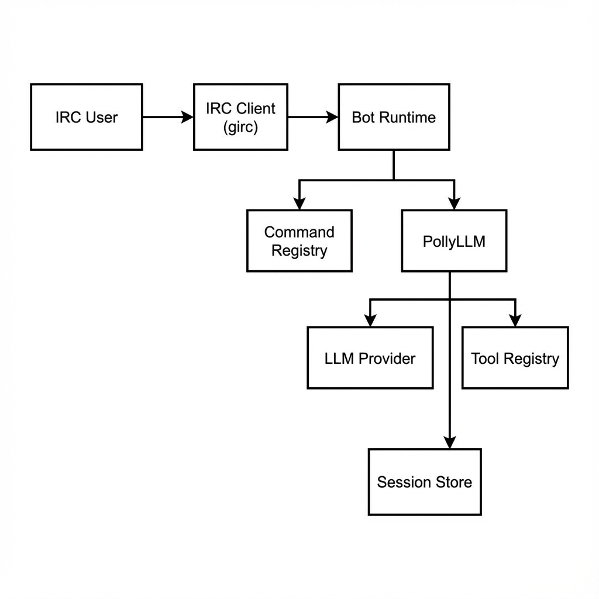

# Soulshack Architecture

## System Overview

Soulshack is an IRC bot designed to bridge traditional IRC chat with modern LLM capabilities. It uses a modular architecture to handle IRC events, manage sessions, and invoke LLM agents.

A key feature is its **Unified Tool System**, which abstracts differences between native Go tools, shell scripts, and MCP servers, allowing the LLM to use them interchangeably.

## Component Diagram

## Request Lifecycle

1.  **Event Reception**: A single `ALL_EVENTS` handler receives every IRC event from `girc`.
2.  **Early Exit**: The handler checks `Registry.Handles()` and drops events with no registered behaviors.
3.  **Context Creation**: A `ChatContext` is created, wrapping the event, configuration, and session.
4.  **Behavior Dispatch**: The `Registry.Process()` method iterates registered behaviors for the event type. The first behavior whose `Check()` returns true wins — its `Execute()` runs and no further behaviors are evaluated.
5.  **Execution**:
    -   **Commands** (via `AddressedBehavior` / `NonAddressedBehavior`) are dispatched to the `CommandRegistry` or sent to the LLM.
    -   **Passive behaviors** (URL watcher, op watcher) call the LLM directly.
    -   **Lifecycle behaviors** (connected, nick/channel errors) handle join, retry, or fatal exit.

### Behavior Priority

Registration order in `run.go` determines priority (first-match-wins):

1.  Lifecycle: `Connected`, `NickError`, `ChannelError`
2.  Passive: `URL`, `Op`, `Join`
3.  Chat: `Addressed`, `NonAddressed`

For example, a non-addressed message containing a URL is handled by the URL behavior, not the non-addressed chat behavior.

## Key Interfaces

### `ChatContextInterface`
The primary interface passed to commands and LLM. It provides access to:
-   IRC operations (Reply, Join, Kick)
-   Configuration
-   Session data
-   User/Channel info

### `System`
Holds the singleton components:
-   `ToolRegistry`: Manages available tools.
-   `SessionStore`: Manages user/channel sessions.
-   `LLM`: The configured LLM client.

### `LLM`
Abstracts the AI provider.
-   `ChatCompletionStream`: Takes a context and request, returns a stream of strings.
